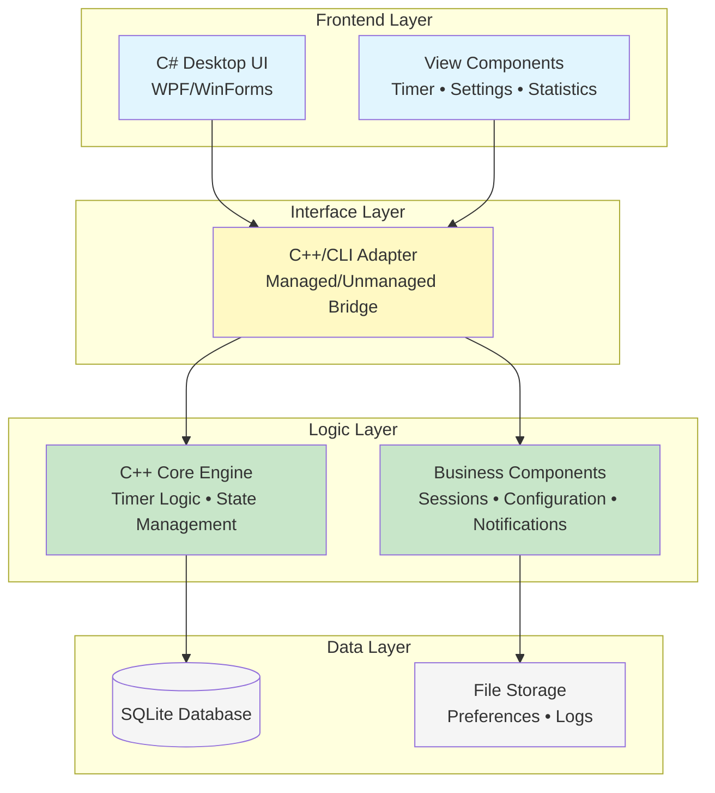
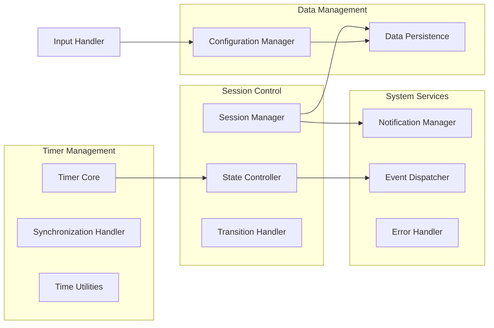
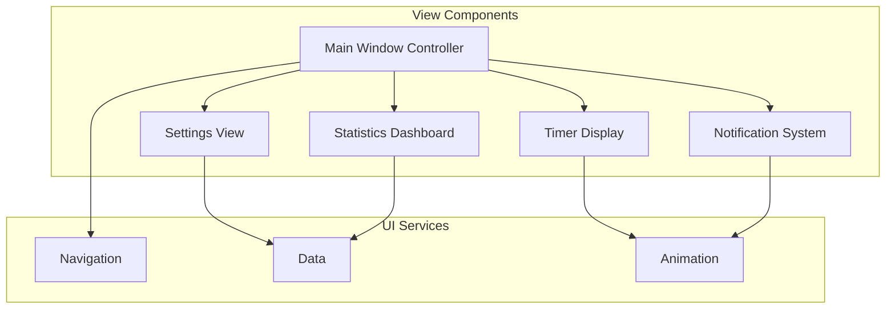
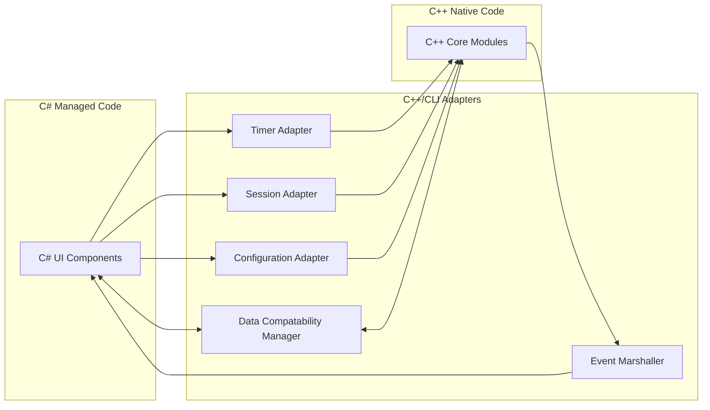

# PomoDojo - Software Design Document

**Date:** November 8, 2025
**Team Members:** Ablasse Kingcaid-Ouedraogo, Sebastian Reyna, Praise Fisher-Afolabi
**Course:** COSC 4320 - Fall 2025
**Instructor:** Professor Wenjuan Huang

## Table of Contents

1. [Abstract](#abstract)
2. [Introduction](#introduction)
3. [High-Level Architecture](#high-level-architecture)
4. [Medium-Level Design](#medium-level-design)
   - [C++ Core Subsystem](#c-core-subsystem)
   - [C# Presentation Subsystem](#c-presentation-subsystem)
   - [Interoperability Layer](#interoperability-layer)

---

## Abstract

PomoDojo is a cross-platform productivity application leveraging the Pomodoro Technique to enhance focus management and prevent burnout. The system employs a hybrid architecture combining C++ for timing logic and state management with C# for the user interface, connected through a carefully designed interoperability layer. This design enables efficient timer operations while maintaining a responsive and intuitive user experience. The application targets students, professionals, and individuals with ADHD, providing customizable focus intervals, automated break reminders, and productivity tracking. The modular architecture ensures maintainability, scalability, and platform independence while delivering accurate timing with less than 200ms drift per session.

---

## Introduction

This document represents the evolution from requirements specification to architectural design, transforming our documented user needs into a concrete software structure. Since the requirements phase, we have refined our understanding of the technical challenges and identified the optimal architectural patterns for implementation. This document presents our design decisions for creating a robust, maintainable productivity application that fulfills all specified functional and non-functional requirements.

The primary goals remain unchanged: implementing a highly accurate timer system, providing an intuitive user interface, and supporting users with focus management challenges. However, our progress has revealed specific technical considerations that shaped our design approach. We have determined that a Model-View-Presenter (MVP) architectural pattern best suits our hybrid language requirements, allowing clean separation between the C++ timing engine and C# presentation layer. This approach addresses our key challenge of cross-language communication while maintaining code modularity.

Significant technical decisions made since the specification phase include adopting C++/CLI (Common Language Infrastructure) as our interoperability solution, providing a method for integration between managed and unmanaged code. We've also refined our data storage strategy, implementing a database for session tracking rather than simple file storage.

The architecture prioritizes extensibility for future features like calendar integration while maintaining the core simplicity users expect from a Pomodoro application. Our design accommodates the planned event scheduler feature through interfaces, though, at the moment, this is out of scope. Through careful component isolation and clear interface definition, PomoDojo's architecture supports both immediate requirements and long-term product evolution.

---

## High-Level Architecture

### System Architecture -

PomoDojo implements a **Multi-Tier Architecture** with clear separation of concerns across three primary layers:

### Component Interaction

PomoDojo's data flows one way:

1. User interactions in the C# UI trigger commands
2. Commands pass through the C++/CLI adapter layer
3. The C++ core processes business logic and state changes
4. State updates propagate back through the adapter
5. UI reflects the new state to the user

---

## Medium-Level Design

### C++ Core -

The C++ backend is organized into multiple functional modules that handle the application's core business logic:

#### Program Organization

**Timer Management Modules**

- **Timer Core**: Handles countdown operations, maintaining timer state, and managing start/pause/resume/stop functionality
- **Synchronization Handler**: Ensures timing precision stays within 200ms tolerance through drift measurement and compensation
- **Time Utilities**: Provides timestamp generation, duration formatting, and time calculation functions

**Session Control Modules**

- **Session Manager**: Orchestrates focus and break session lifecycles, maintains session history, and manages cycle counting
- **State Controller**: Implements finite state machine for application states and manages valid state transitions
- **Session Transition Handler**: Determines next session types and manages smooth transitions between focus and break periods

**Data Management Modules **

- **Configuration Manager**: Handles user preferences including timer durations and cycle settings with validation
- **Data Persistence Module**: Manages database operations for session storage, retrieval, and cleanup

**System Service Modules**

- **Notification Manager**: Queues and triggers system notifications for session events
- **Event Dispatcher**: Manages event propagation and listener registration across components
- **Error Handler**: Provides centralized error logging, critical error handling, and recovery mechanisms

**Misc Modules**

- **Input Handler**: Input validation for timer durations, cycle lengths, and user input sanitization

---

### C# Presentation Subsystem

The presentation layer is structured around view components that provide user interaction capabilities:

#### Presentation Module Structure

**Core View Components (5 units)**

- **Main Window Controller**: Primary application container managing navigation and view coordination
- **Timer Display**: Visual timer representation with progress indicators and time formatting
- **Settings View**: Configuration interface for customizing timer durations and application preferences
- **Statistics Dashboard**: Productivity metrics visualization with daily/weekly charts and data export
- **Notification System**: Overlay notifications for session transitions with user response handling

**Supporting UI Services**

- **Navigation**: Manages view transitions and maintains navigation state
- **Data**: Synchronizes UI elements with underlying data models
- **Animation**: Handles visual transitions and timer progress animations

---

### Interface Layer

The C++/CLI adapter layer provides the bridge between C# and C++:

#### Adapter Module Functions

**Primary Adapter Components (5 units)**

- **Timer Adapter**: Synchronizes timer related data
- **Session Adapter**: Synchronizes session management operations
- **Configuration Adapter**: Configuration management interface
- **Event Marshaller**: Handles event comunication
- **Data Compatability Manager**: Handles data type conversions between layers

#### Interface Design Principles

The interoperability layer follows these design principles:

- **Event-Driven Communication**: Asynchronous events prevent blocking between layers
- **Type Safety**: Strong typing ensures data integrity across language boundaries
- **Performance Optimization**: Zero-copy transfers where possible